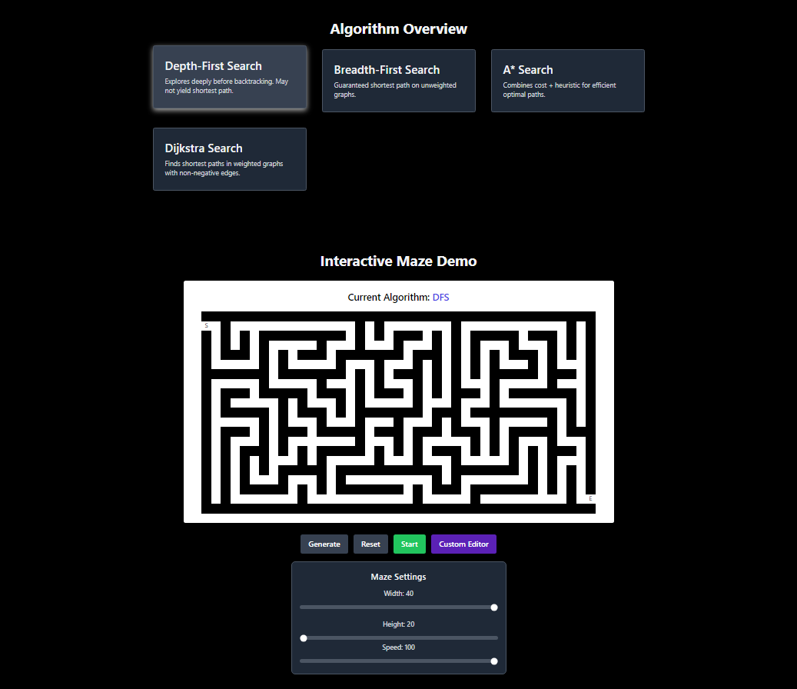
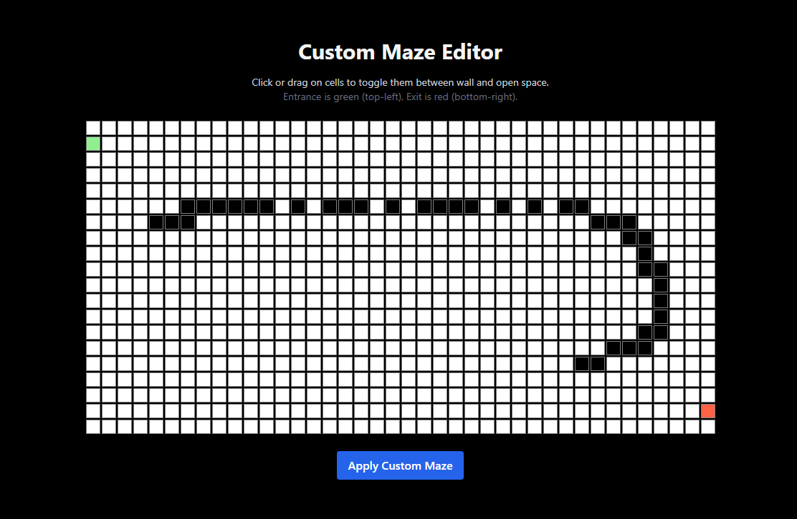
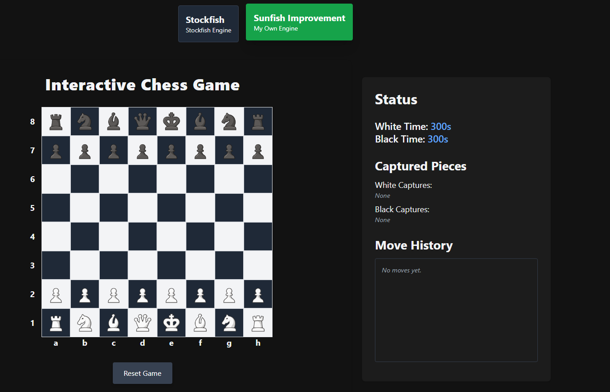
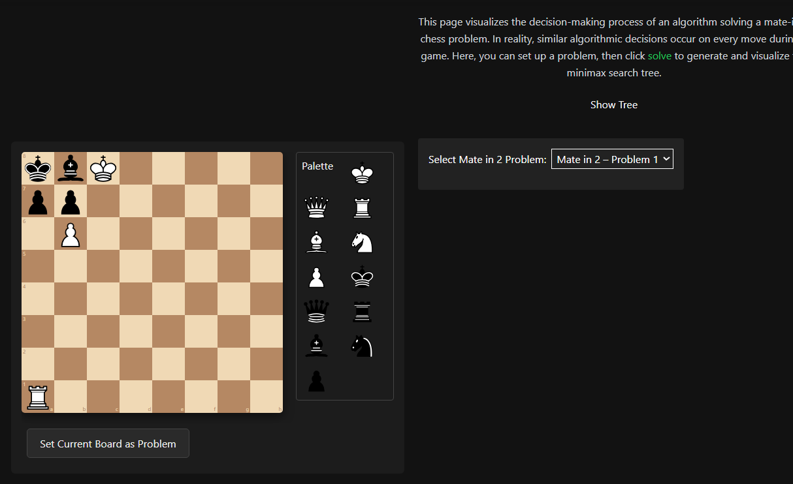
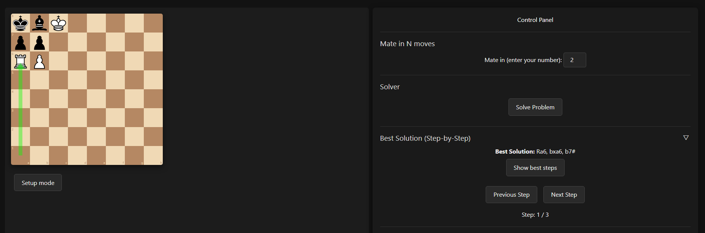
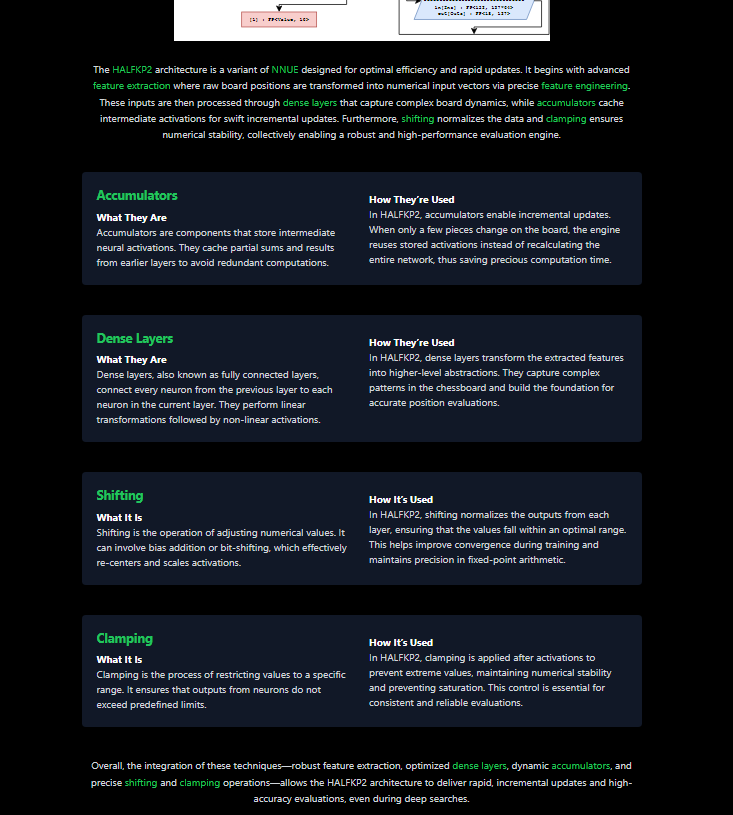

# 🧠 Algorithm Solver & Chess AI Visualizer – Final Year Project

Live Demo: https://nnuelab-platfrom-front.onrender.com/

Welcome to my **Final Year Project (FYP)** — a full-stack platform for visualizing and exploring algorithmic intelligence in action. The system is designed with an intuitive UI and real-time feedback for hands-on learning and experimentation.

This platform focuses on:

- 🧭 **Maze and pathfinding algorithms**
- ♟️ **Chess AI with Stockfish integration**
- 🌳 **Alpha-Beta pruning decision tree visualizations**
- 🚀 A guided user interface for intuitive exploration

📁 **Detailed technical report, diagrams, and evaluation** available in the [`/latex_FYP/`](./latex_FYP/) folder.

---

## 🧰 Tech Stack

This is a **full-stack project** composed of:

| Layer         | Technology                      | Description                                              |
|--------------|----------------------------------|----------------------------------------------------------|
| Frontend     | **React** (JavaScript)           | Component-based UI with responsive views                 |
| Backend      | **Python FastAPI**               | API server for AI and algorithmic logic                  |
| AI / Logic   | **PyTorch**, **Stockfish (WASM)**| Chess AI and algorithm computation offloaded to backend  |
| Styling      | **CSS Modules / Tailwind (opt)** | Clean and isolated component styling                     |


---

## 🌐 Pages Overview

### 1. 🧩 Maze Visualizer (`/visualizer`)

An interactive playground for solving mazes using search algorithms like **BFS** and **DFS**.

**Key Features**
- ✅ DFS & BFS support
- ✅ Custom maze creation (walls, weights)
- ✅ Animation controls (speed, pause, reset)
- ✅ Benchmark-style feedback (nodes visited, execution path)

**Screenshots**



---

### 2. ♟️ Chess Arena (`/chess`)

Play chess against the **Stockfish engine** and visualize decision-making in real time.

**Key Features**
- ✅ Play against Stockfish (WASM in-browser)
- ✅ Move history log
- ✅ Custom engine support (WIP: *yanfish*)
- ✅ Interactive UI with evaluation cues

**Screenshots**


---

### 3. 🌳 Alpha-Beta Pruning Visualizer (`/minimax`)

Visualize the **Minimax algorithm** and how **Alpha-Beta pruning** optimizes decision-making trees.

**Key Features**
- ✅ Expandable game tree
- ✅ Min/max node identification
- ✅ Pruning visual cues
- 🚧 Known Issues: Tree glitches on deep branches

**Screenshots**



---

### 4. 🧭 Guided Walkthrough (`/guide`)

A walkthrough to help new users get started with each tool on the platform.

**Key Features**
- ✅ Interactive tooltips/modals
- ✅ Step-by-step flow of app usage
- ✅ Restart/skip available

**Screenshot**


---

## 🛠️ Getting Started

### Requirements

- Node.js v16+
- npm or yarn
- Python 3.10+ (for backend server)
- Git

### Setup Instructions

```bash
# Clone the repository
git clone https://github.com/yourusername/NnueLab-Platform.git
cd NnueLab-Platform

# Install frontend dependencies
npm install

# Start frontend
npm start

# (Optional) Start backend server
cd backend
python endpoint.py
